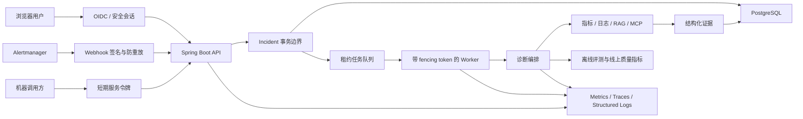

# SuperBizAgent 优化实施方案

## 1. 方案摘要

本方案的核心目标不是继续堆叠 Agent、工具或页面功能，而是把 SuperBizAgent 从“功能完整的智能 OnCall 原型”提升为“可安全上线、可证明有效、可稳定扩展的诊断系统”。

系统优化遵循一个统一目标：

> 在证据可追溯、安全可控、成本可接受的前提下，缩短从告警产生到可信诊断结论的时间。

为实现这一目标，优化工作分为五条主线：

1. 生产安全：消除默认不安全配置，打通浏览器、Webhook 和机器 API 的认证边界。
2. 诊断质量：建立事故评测集，用可重复指标衡量根因准确性、证据可靠性和诊断成本。
3. 任务一致性：消除后台任务租约丢失后的重复执行和文档上传覆盖竞态。
4. 性能与可观测性：解决事故列表 N+1 查询，建立应用、依赖、任务和 Agent 的运行指标。
5. 工程治理：收紧质量门禁，拆分高复杂度模块，建立依赖和发布治理。

建议按 6 周推进。第 1–2 周优先处理生产安全和评测基线，第 2–4 周解决任务一致性、上传一致性和数据库性能，第 3–5 周建设可观测性，第 5–6 周完成工程治理和上线验收。

## 2. 优化目标与边界

### 2.1 目标

- 生产实例不能在未鉴权、使用默认密码或启用 Mock 数据时启动。
- 每次模型、Prompt、RAG 或工具策略变更都能量化判断质量是提升还是退化。
- 同一个后台任务在租约切换时不能被两个 Worker 同时提交结果。
- 文档索引任务必须绑定不可变文件版本，重试结果可复现。
- 事故列表查询复杂度不随 evidence 总量线性放大，并支持稳定分页。
- 运维人员能够定位一次诊断慢、失败或费用异常的具体环节。
- 日志、指标和证据持久化遵守最小披露原则。

### 2.2 非目标

- 本阶段不新增 Agent 角色或外部工具。
- 本阶段不更换 Milvus、PostgreSQL、Redis 或大模型供应商。
- 在评测基线建立前，不大规模重写 Prompt 或诊断编排逻辑。
- 在关键一致性问题解决前，不进行纯粹为了代码整洁的大规模重构。

## 3. 优先级原则

采用“影响范围 × 发生概率 × 可检测性 × 修复成本”进行排序：

| 优先级 | 判定标准 | 处理要求 |
|---|---|---|
| P0 | 可能造成未授权访问、虚假诊断、生产不可用，或无法证明核心产品有效 | 进入第一个发布周期，未完成不得生产上线 |
| P1 | 可能造成重复执行、数据错配、性能失控或故障不可定位 | 不依赖 P0 的设计与测试可并行；生产切换必须在 P0 退出门通过后实施 |
| P2 | 主要影响交付速度、维护成本和长期演进 | 在关键行为已有测试保护后实施 |

### 3.1 治理与责任模型

正式启动前，由项目负责人将下表中的角色替换为具体人员。一个角色可以由多人承担，但每项交付只能有一个最终负责者（DRI）。

| 工作流 | DRI | 主要参与者 | 验收人/批准人 |
|---|---|---|---|
| 生产安全与认证 | 安全负责人 | 后端、前端、平台工程 | 安全负责人 + 发布负责人 |
| 诊断质量评测 | Agent/算法负责人 | SRE 事故专家、测试、后端 | SRE 负责人 + 产品负责人 |
| 后台任务一致性 | 后端负责人 | 数据库工程、测试/SRE | 架构负责人 |
| 文档上传与索引 | 知识库模块负责人 | 后端、测试、安全 | 后端负责人 |
| 查询性能与数据访问 | 数据访问负责人 | DBA、后端、前端 | 架构负责人 + SRE |
| 可观测性、成本与隐私 | SRE/平台负责人 | 后端、安全、隐私负责人 | SRE 负责人 + 隐私负责人 |
| 工程治理 | 技术负责人 | 全体开发、测试、DevOps | 发布负责人 |

决策与升级规则：

- 安全、隐私和生产发布分别由对应批准人签字，不以开发自验代替。
- 跨工作流冲突由架构负责人裁决；质量与上线速度冲突由产品负责人和 SRE 负责人共同裁决。
- 每周评审风险、指标和依赖；P0 阻塞超过两个工作日必须升级到项目负责人。

### 3.2 Phase 0 决策门

进入 Phase 1 实现前必须完成并批准以下 ADR，不保留“二选一”到开发阶段：

- 生产部署目标：Docker Compose、Kubernetes/Helm 或其他平台。
- 身份提供方：企业 OIDC/SSO 或受控的服务端账号体系。
- 浏览器认证：服务端 Session Cookie 的生命周期、CSRF 和注销策略。
- 机器身份：令牌签发、scope、轮换、撤销和审计策略。
- Secret 来源：Secret Manager、Kubernetes Secret 或部署平台等唯一权威来源。
- 多租户边界：租户识别方式及 Incident、Session、Document、Evidence 的对象级授权矩阵。

选择标准按安全合规、现有基础设施、运维复杂度、开发成本和回滚能力评分。ADR 必须包含最终选择、被拒绝方案、迁移影响、负责人和批准日期。

## 4. 目标架构

## 5. 工作流一：生产安全与认证（P0）

### 5.1 配置与部署分层

实施内容：

- 保留 `docker-compose.yml` 作为开发配置，新增明确的生产部署配置或 Helm/Kubernetes 配置。
- 生产环境强制激活 `prod` profile。
- 扩展生产配置校验：禁止默认数据库密码、禁止 Mock、禁止模拟告警、禁止通配 CORS、禁止空鉴权配置。
- PostgreSQL、Redis、Milvus、Attu 在开发环境仅绑定 `127.0.0.1`；生产环境不直接暴露公网端口。
- Secret 只通过 Secret Manager、容器 Secret 或受控环境变量注入，不写入仓库和镜像层。
- 所有 Mock 响应增加结构化来源字段，生产报告遇到 Mock evidence 时拒绝完成或明确降级为测试报告。

验收标准：

- 缺少任一生产 Secret 时应用启动失败并给出明确错误。
- `prod` profile 下开启任一 Mock 开关时应用启动失败。
- 未设置额外端口映射时，基础设施服务不能被外部网络访问。
- 自动化测试覆盖全部生产配置拒绝场景。

### 5.2 统一认证模型

实施内容：

- 引入 Spring Security，替换仅依赖静态 `X-API-Key` 的统一拦截器。
- 浏览器使用 OIDC 或服务端登录会话，凭证保存在 `HttpOnly + Secure + SameSite` Cookie 中。
- 明确实施 CSRF 防护、会话固定攻击防护、绝对/空闲过期、服务端注销和并发会话策略。
- SSE 复用同源会话 Cookie，避免在 URL 中携带长期 Token。
- Webhook 使用独立密钥、HMAC 签名、请求时间戳和幂等键，拒绝超时或重复请求。
- 机器 API 使用短期服务令牌，并区分只读查询、诊断触发、知识库管理等权限。
- 服务令牌必须支持轮换、撤销和泄露后的紧急失效，不允许以永不过期静态 Token 作为生产方案。
- 对 Incident、Session、Document 和 Evidence 执行对象级授权，不能只验证“是否已登录”。
- 对人工确认、拒绝、取消诊断、归档案例和文档上传记录操作者审计信息。

验收标准：

- 开启生产鉴权后，Web 控制台聊天、事故管理、文档上传和 SSE 均可正常工作。
- 无权限主体不能读取聊天历史、原始 evidence 或触发诊断。
- Webhook 重放测试和签名篡改测试均被拒绝。
- 安全日志不包含 Token、Cookie、完整 Prompt 或原始日志片段。
- Phase 0 形成“威胁—控制—自动化测试—责任人”矩阵；P0 威胁对应测试全部通过。

## 6. 工作流二：诊断质量评测体系（P0）

### 6.1 建立事故基准集

首批整理 30–50 个脱敏事故场景，后续扩展至 100 个以上。每个场景包含：

- 告警输入、关键标签和时间范围。
- 可查询的指标、日志、知识文档和历史案例夹具。
- 专家确认的根因、关键证据、允许的替代解释和不可下结论项。
- 期望调用的工具类别及禁止调用的高风险工具。
- 诊断失败或证据不足时的正确降级行为。

场景至少覆盖 CPU、内存、P99、错误率、重启、OOM、依赖不可用、慢 SQL、无数据、依赖超时和多告警关联。

### 6.2 评测指标

| 维度 | 指标 | 说明 |
|---|---|---|
| 正确性 | 根因 Top-1/Top-3 命中率 | 与专家标注对比 |
| 证据性 | evidence 引用精确率 | 被引用证据是否支持对应结论 |
| 完整性 | 关键证据召回率 | 是否找到事故要求的核心证据 |
| 安全性 | 无依据断言率 | 没有证据仍给出确定结论的比例 |
| 降级能力 | 诚实失败率 | 证据不足时是否明确说明缺口 |
| 效率 | TTDR、工具次数、模型调用次数 | 衡量响应时间和编排效率 |
| 成本 | 单次诊断 Token 与外部调用成本 | 防止质量提升依赖无限成本 |
| 人工反馈 | 确认率、拒绝率、拒绝原因 | 连接线上真实效果 |

### 6.3 质量门禁

- Prompt、模型、RAG、工具策略和报告校验逻辑的变更必须运行离线评测。
- 每个指标在评测配置中声明公式、样本集、方向、基线、允许退化预算和失败处置，CI 不依赖人工解释“显著”。
- Top-k 根因按专家标注的主根因、可接受替代根因和错误根因分级计分；“证据不足”只在场景允许降级时计为正确。
- 非确定模型至少使用固定参数重复运行约定次数，报告均值、离散度和置信区间；门禁以预先声明的统计规则裁决。
- 冒烟集用于 PR 快速反馈，完整上线集用于发布门禁，隐藏集由评测负责人维护，开发者不能针对隐藏答案调 Prompt。
- 默认门禁建议：关键正确性指标的置信区间下界不低于基线允许预算；无依据断言率不得上升；P95 耗时或平均成本增加超过预设比例时必须由产品和 SRE 批准。具体比例在 Phase 0 基线测量后冻结，不得在验收时临时调整。
- 评测结果保存模型版本、Prompt 版本、知识库版本、参数和随机种子等可复现实验信息。
- 线上仅记录聚合指标和脱敏样本；事故内容进入评测集前必须经过人工脱敏审批。

验收标准：

- CI 能一条命令运行固定场景评测并生成机器可读和人工可读报告。
- 任一诊断报告可以追溯到模型、Prompt、工具和知识库版本。
- 上线决策包含质量、延迟和成本三类对比结果。

## 7. 工作流三：后台任务一致性（P1）

### 7.1 引入 fencing token

数据模型为 `background_jobs` 增加 `lease_version`：

- 每次 claim 原子递增 `lease_version`。
- Worker 持有 `job_id + lease_owner + lease_version` 三元组。
- heartbeat、complete、retry、fail 等写操作必须同时匹配三元组。
- heartbeat 返回租约丢失时，Worker 立即停止，不再提交业务结果。
- Handler 在模型调用、Milvus 写入和最终报告提交等关键副作用前检查租约。
- “调用前检查”不能独立作为一致性保证：所有可重复外部副作用必须携带稳定幂等键，例如 `jobId + businessVersion`。
- 无法事务性提交的 Milvus/外部写入先写入带 lease/document version 的暂存版本，只有持有当前 fencing token 的 Worker 才能条件激活；否则执行补偿或等待垃圾回收。
- PostgreSQL 最终状态更新必须在同一条件语句中校验 fencing token，禁止“先检查、后无条件写入”。

### 7.2 幂等与恢复

- DiagnosisRun 的终态写入保持条件更新，旧租约不能覆盖新租约结果。
- 文档索引按 `document_version` 幂等，重复执行不会产生重复向量。
- 任务恢复使用带抖动的指数退避，区分可重试和不可重试错误。
- Worker 关闭时先停止 claim，再等待有界时间，最后中断未完成任务。
- 单次轮询按空闲 Worker 数批量 claim，避免当前“一次调度只领取一个任务”的吞吐限制。

验收标准：

- 人工制造心跳超时后，旧 Worker 无法完成或覆盖任务。
- 两个应用实例并发 claim 时，每个 lease version 只有一个有效执行者。
- 重启、网络闪断和数据库短暂不可用场景下，任务最终状态可解释且无重复副作用。
- 增加 PostgreSQL Testcontainers 并发集成测试。
- 故障注入覆盖“租约检查后立即过期”“外部写成功但数据库提交失败”“旧 Worker 晚到完成”等竞态。

## 8. 工作流四：文档上传与索引一致性（P1）

### 8.1 不可变文件版本

- 上传先写入临时文件，流式计算 SHA-256、实际大小和 MIME 类型。
- 校验成功后原子移动到 `documents/{documentId}/{version}/{hash}`。
- 数据库保存原始文件名、物理路径、hash、版本、上传者和状态。
- 索引任务只引用不可变 `documentVersionId`，不再引用可能被覆盖的同名路径。
- 新版本索引成功后再原子切换 active version；失败时旧版本继续可用。

### 8.2 生命周期

- 限制文件大小、文本编码、文档字符数和单租户存储配额。
- 对失败临时文件、废弃版本和孤儿索引建立延迟清理任务。
- Milvus metadata 增加 `document_id`、`document_version` 和 `content_hash`。
- 删除或回滚文档时使用版本标记，不直接先删旧向量再写新向量。

验收标准：

- 两个同名文件并发上传时分别生成独立版本，任务内容不会串读。
- 数据库入队失败不会覆盖当前有效文档。
- 索引失败后搜索仍返回上一有效版本。
- 重试相同版本不会增加重复向量。

## 9. 工作流五：查询性能与数据访问（P1）

### 9.1 事故列表专用查询模型

- 新增只包含列表字段的 `IncidentListItem`，不加载 alert payload、完整报告和 evidence。
- 将状态、级别、诊断状态、人工审核状态和关键字筛选下推到 SQL。
- 使用 `updated_at + id` 游标分页，默认限制每页数量，并设置最大页大小。
- 游标包含唯一排序键和查询快照上界；API 明确采用快照分页或最终一致分页，并说明并发更新时允许的重复/遗漏语义。
- 使用窗口函数或 lateral join 获取最新 DiagnosisRun 摘要，避免逐 Incident 查询。
- alerts、runs、evidence 只在详情页按需加载；evidence 支持独立分页。

### 9.2 性能验证

- 生成 1 万 Incident、每个 5 个 Run、每个 20 条 evidence 的测试数据。
- 记录 SQL 数量、P50/P95/P99 延迟、数据库 CPU 和响应体大小。
- 使用 `EXPLAIN ANALYZE` 决定组合索引，不以“可能有用”为由盲目增加索引。
- 增加并发更新分页契约测试，验证游标编码、唯一排序和选定一致性语义。

建议验收目标：

- 事故列表一次请求使用固定数量 SQL，不随结果条数增长。
- 50 条列表页不返回完整 evidence 和报告。
- 在 Phase 0 冻结的测试环境和数据规模下，列表接口 P95 目标为 300 ms；若基线证明目标不合理，必须在开发开始前完成书面调整和批准。
- Phase 0 冻结性能环境：CPU/内存、PostgreSQL 版本与参数、数据分布、并发数、查询组合、预热次数和允许波动；目标冻结后不得在验收阶段移动。

## 10. 工作流六：可观测性、成本与隐私（P1）

### 10.1 健康检查

- 引入 Spring Boot Actuator 和 Micrometer。
- Liveness 只反映进程自身能否工作。
- Readiness 反映数据库、任务系统等关键能力是否可服务。
- Milvus、Redis、Prometheus、CLS、DashScope 和 MCP 作为独立依赖健康项，不再用 Milvus 健康代替应用健康。

### 10.2 指标与链路

所有请求和任务统一传播：

- `traceId`
- `incidentId`
- `runId`
- `jobId`
- `sessionId` 的不可逆摘要

首批指标：

- API：请求量、错误率、P95/P99 延迟、SSE 连接数。
- Job：队列深度、claim 延迟、执行时长、重试、租约过期、取消和失败。
- Agent：诊断时长、模型调用次数、工具调用次数、工具成功率、证据缺失率。
- 依赖：熔断状态、超时率、重试次数和慢调用率。
- 成本：按模型、租户和诊断类型聚合 Token 与外部调用费用。

### 10.3 隐私控制

- 禁止记录完整用户问题、模型流式内容、长期记忆、API Token 和原始日志片段。
- 默认日志仅记录长度、类型、hash、耗时和关联 ID。
- evidence 的 `raw_fragment` 设置大小、保留期和访问权限。
- 对 Prompt 注入内容和 MCP 返回结果进行敏感字段过滤。

验收标准：

- 任一失败诊断可以通过 `runId` 关联 API、Job、模型和工具日志。
- 告警能够覆盖队列堆积、租约过期、模型错误率和诊断成本异常。
- 日志扫描测试确认不存在配置中的 Secret 和测试敏感样本。

## 11. 工作流七：工程治理（P2）

### 11.1 质量门禁

- 先冻结当前 Checkstyle 基线，避免新增违规；再分批清理现有违规。
- 清理完成后将 `failOnViolation` 改为 `true`。
- CI 顺序统一为：编译、单测、前端测试、静态分析、数据库集成测试、离线 Agent 评测、镜像构建和安全扫描。
- Docker 构建不再承担“跳过测试后的首次验证”，而只消费 CI 已验证的制品。

### 11.2 模块拆分

在行为测试覆盖后逐步拆分：

- `ChatController`：请求校验、同步聊天、流式聊天、会话 API。
- `IncidentService`：聚合、诊断运行、人工审核、查询服务。
- `QueryLogsTools` / `QueryMetricsTools`：参数解析、查询客户端、结果归一化、Mock fixture。
- 前端 `app.js`：API client、chat、incident、evidence、knowledge、SSE、共享 UI。
- CSS：tokens、layout、components、feature modules 和 responsive。

### 11.3 依赖与前端供应链

- 前端第三方库构建时锁定并本地打包，不依赖运行时公共 CDN。
- 增加 CSP；若仍使用外部静态资源，必须使用 SRI 和严格域名白名单。
- 使用自动化依赖更新和漏洞扫描，但框架大版本升级必须通过完整评测与集成测试。

## 12. 分阶段实施计划

以下周期按 2–3 名后端、1 名前端、1 名测试/SRE 可部分投入估算；实际应根据团队规模调整。

| 阶段 | 周期 | 核心交付 | 上线条件 |
|---|---|---|---|
| Phase 0：基线与决策 | 第 1 周 | 威胁模型、性能基线、10 场景冒烟集、指标口径、认证/部署 ADR、RACI | ADR 获批、DRI 明确、指标和测试环境冻结 |
| Phase 1：安全 | 第 1–2 周 | 生产配置分层、Spring Security、Webhook 防重放、UI/SSE 鉴权 | 全部 P0 安全用例通过；生产配置无 Mock、默认密码和未鉴权路径 |
| Phase 2：一致性 | 第 2–4 周 | fencing token、幂等任务、不可变文档版本 | 第 2 周仅并行设计/测试夹具；生产实现待 Phase 1 退出门后合入；并发和故障注入测试通过 |
| Phase 3：性能与观测 | 第 3–5 周 | SQL 分页、消除 N+1、Actuator、Metrics、结构化日志 | 性能目标和告警演练通过 |
| Phase 4：治理 | 第 5–6 周 | CI 质量门禁、模块拆分第一批、依赖治理 | 全量回归和发布演练通过 |

## 13. 首个迭代建议任务包

首个 10 个工作日只处理 P0 和必要基线：

1. 定义 `dev`、`test`、`prod` 配置契约并补充启动失败测试。
2. 将生产 Compose/部署配置改为安全默认值，关闭基础设施外部端口。
3. 设计浏览器、Webhook、机器 API 三类认证方案并形成 ADR。
4. 实现 Spring Security 最小闭环，确保 UI、Fetch 和 SSE 可用。
5. 建立 10 个代表性事故的 PR 冒烟评测集和评测命令；30–50 场景完整集在 Phase 1 结束前完成并作为上线门禁。
6. 记录现有模型在正确性、证据、延迟、工具次数和成本上的基线。
7. 引入 Actuator，拆分 liveness、readiness 和依赖健康状态。
8. 建立 Secret/敏感日志扫描，移除完整 Prompt 和模型流式输出日志。

迭代结束评审只回答四个问题：

- 生产实例是否默认安全？
- Web 控制台在安全模式下是否完整可用？
- 当前 Agent 质量和成本是否已经可量化？
- 一次失败诊断是否已经能被可靠定位？
- Phase 0 的认证、部署、Secret 和多租户决策是否已经获批且不存在实现分叉？

## 14. 发布、灰度与回滚

- 数据库迁移采用向前兼容的 expand/contract 策略，先加字段和双写，再切换读取，最后清理旧逻辑。
- 新任务租约协议上线期间，旧 Worker 与新 Worker 不得混合消费同一任务类型；通过任务版本或独立队列隔离。
- 新事故列表接口与旧接口并行灰度，对比结果数量、筛选语义和延迟后再切换前端。
- 新认证先在预发布环境验证 UI、SSE、Webhook 和机器调用，再按租户或流量逐步启用。
- Prompt 或模型变更保留上一版本配置，可在质量或成本告警触发时快速回滚。
- 文档新版本索引失败时只回滚 active version 指针，不删除上一有效索引。

## 15. 风险与控制措施

| 风险 | 影响 | 控制措施 |
|---|---|---|
| 安全改造导致现有 UI 401 | 控制台不可用 | 先补端到端认证测试，UI 与后端同版本发布 |
| 租约协议升级造成任务停滞 | 诊断无法执行 | 任务协议版本化、灰度 Worker、保留人工恢复脚本 |
| SQL 重构改变筛选语义 | 列表结果不一致 | 双读比对、固定数据集契约测试 |
| 评测集过拟合 | 离线分数提升但线上无收益 | 保留隐藏集，定期加入真实拒绝案例 |
| 可观测性采集敏感内容 | 隐私泄露 | 默认字段白名单、脱敏测试、最短必要保留期 |
| 模块拆分范围膨胀 | 延误关键修复 | P2 重构必须绑定明确行为测试和独立发布目标 |

## 16. 完成定义

整个优化阶段完成需要同时满足：

- P0、P1 项目均有自动化验收证据，不以人工口头确认代替。
- 生产配置、安全、任务恢复、数据库性能和 Agent 质量都有明确基线及告警阈值。
- Java、前端、静态分析、PostgreSQL 集成测试和离线 Agent 评测全部进入 CI。
- 不存在已知的旧租约覆盖、同名上传串读、事故列表 N+1 或安全模式下 UI 不可用问题。
- 生产发布和回滚至少完成一次预发布演练。
- 每项指标均有负责人、数据来源、计算方式和复盘周期。

## 17. 建议决策

建议立即批准 Phase 0 和 Phase 1，并暂停以下工作直到基线完成：

- 新增 Agent 或扩大 Agent 工具面。
- 未经过评测的 Prompt 大改。
- 与关键风险无关的大规模代码重构。
- 将当前默认 Compose 配置直接用于公网或生产环境。

第一阶段完成后，再依据评测数据决定后续优化应优先投入诊断算法、知识检索、工具策略还是基础设施扩容。
